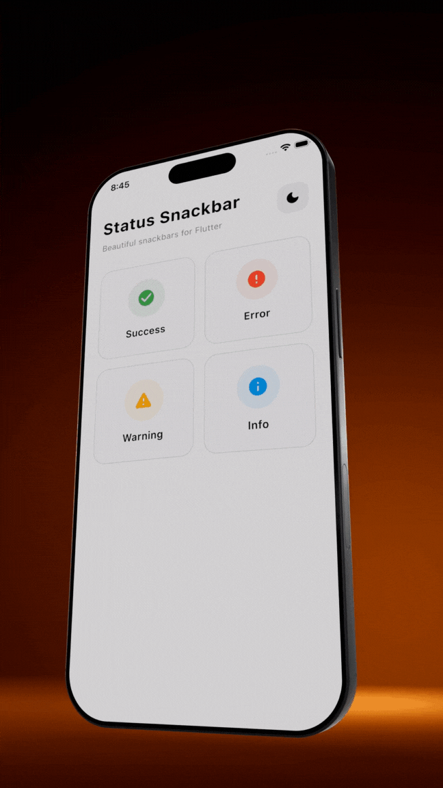

# Status Snackbar

Beautiful, customizable snackbars with multiple states for Flutter. Supports success, error, warning, and info states with automatic dark mode support.

[](https://pub.dev/packages/status_snackbar)
[](https://opensource.org/licenses/MIT)

## Platform Support

| Android | iOS | Web | macOS | Windows | Linux |
|:-------:|:---:|:---:|:-----:|:-------:|:-----:|
| ✅ | ✅ | ✅ | ✅ | ✅ | ✅ |

## Features

- 4 built-in states: **Success**, **Error**, **Warning**, **Info**
- Automatic **dark mode** support
- Optional **subtitle** for additional details
- **Close button** to dismiss (can be hidden)
- **Context extension** for easy access
- Customizable **duration**
- **Custom icons** and **colors** support
- **Position control**: Show at top or bottom of screen
- **Action button**: Add interactive buttons with callbacks
- **Dismiss callback**: Get notified when snackbar closes
- Beautiful, modern design

## Preview



## Installation

Add this to your `pubspec.yaml`:

```yaml
dependencies:
  status_snackbar: ^1.1.0
```

Then run:

```bash
flutter pub get
```

## Usage

### Import

```dart
import 'package:status_snackbar/status_snackbar.dart';
```

### Using Static Methods

```dart
// Success snackbar
StatusSnackbar.showSuccess(context, 'Saved successfully!');

// Error snackbar
StatusSnackbar.showError(context, 'Something went wrong');

// Warning snackbar
StatusSnackbar.showWarning(context, 'Please check your input');

// Info snackbar
StatusSnackbar.showInfo(context, 'New update available');
```

### Using Context Extension

```dart
// Success
context.showSuccessSnackbar('Done!');

// Error with subtitle
context.showErrorSnackbar(
  'Failed to save',
  subTitle: 'Please check your connection',
);

// Warning
context.showWarningSnackbar('Low battery');

// Info
context.showInfoSnackbar('Syncing...');
```

### With Subtitle

```dart
StatusSnackbar.showError(
  context,
  'Upload failed',
  subTitle: 'File size exceeds 10MB limit',
);
```

### Custom Duration

```dart
StatusSnackbar.showSuccess(
  context,
  'Auto-saving...',
  durationSeconds: 5,
);
```

### Position (Top or Bottom)

```dart
// Show at top of screen
context.showInfoSnackbar(
  'New message received',
  position: SnackbarPosition.top,
);

// Show at bottom (default)
StatusSnackbar.showSuccess(
  context,
  'Saved!',
  position: SnackbarPosition.bottom,
);
```

### Action Button

```dart
// With action button
context.showErrorSnackbar(
  'Item deleted',
  actionLabel: 'Undo',
  onAction: () {
    // Restore the item
    print('Undo pressed!');
  },
);

// Action with dismiss callback
StatusSnackbar.showWarning(
  context,
  'Changes pending',
  actionLabel: 'Save Now',
  onAction: () => saveChanges(),
  onDismiss: () => print('Snackbar closed'),
);
```

### Hide Close Button

```dart
// Without close button
context.showInfoSnackbar(
  'Processing...',
  showCloseButton: false,
);
```

### Hide Icon

```dart
// Without icon
context.showSuccessSnackbar(
  'Done!',
  showIcon: false,
);
```

### Generic Show Method

```dart
StatusSnackbar.show(
  context,
  'Custom message',
  SnackbarState.info,
  subTitle: 'Additional details',
  durationSeconds: 4,
);
```

## Customization

The package uses predefined color schemes that automatically adapt to light/dark themes:

| State | Light Background | Dark Background | Icon |
|-------|-----------------|-----------------|------|
| Success | Green 100 | Green 900 | check_circle |
| Error | Red 100 | Red 900 | error |
| Warning | Amber 100 | Amber 900 | warning |
| Info | Blue 100 | Blue 900 | info |

### Custom Icons

You can easily customize the icon for any snackbar:

```dart
// Custom icon with default colors
context.showSuccessSnackbar(
  'File uploaded!',
  icon: Icons.cloud_done,
);

// Custom icon and color
StatusSnackbar.showError(
  context,
  'No internet connection',
  icon: Icons.wifi_off,
  iconColor: Colors.orange,
);
```

### Fully Custom Snackbar

Create completely custom snackbars with your own configuration:

```dart
// Using copyWith to modify defaults
context.showCustomSnackbar(
  'Payment received!',
  config: SnackbarConfigs.success.copyWith(
    icon: Icons.payment,
    iconColor: Colors.teal,
  ),
);

// Fully custom config
StatusSnackbar.showCustom(
  context,
  'Custom notification',
  config: SnackbarConfig(
    lightBackgroundColor: Colors.purple.shade100,
    lightTextColor: Colors.purple.shade900,
    darkBackgroundColor: Colors.purple.shade900,
    darkTextColor: Colors.purple.shade100,
    iconColor: Colors.purple,
    icon: Icons.star,
  ),
);
```

## Example

See the [example](example/) folder for a complete example app.

```dart
import 'package:flutter/material.dart';
import 'package:status_snackbar/status_snackbar.dart';

void main() => runApp(const MyApp());

class MyApp extends StatelessWidget {
  const MyApp({super.key});

  @override
  Widget build(BuildContext context) {
    return MaterialApp(
      home: Scaffold(
        body: Center(
          child: ElevatedButton(
            onPressed: () {
              context.showSuccessSnackbar('Hello, World!');
            },
            child: const Text('Show Snackbar'),
          ),
        ),
      ),
    );
  }
}
```

## License

MIT License - see the [LICENSE](LICENSE) file for details.

## Contributing

Contributions are welcome! Please feel free to submit a Pull Request.

## Author

Made with love by [Aravinthkannan2002](https://github.com/Aravinthkannan2002)
